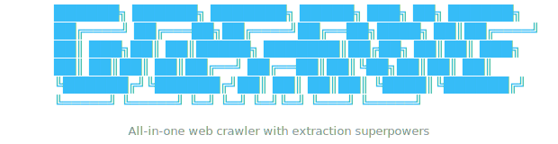

<p align="center">
  <picture>
    <source media="(prefers-color-scheme: dark)" srcset="assets/banner-dark.svg">
    <source media="(prefers-color-scheme: light)" srcset="assets/banner-light.svg">
    
  </picture>
</p>

<h4 align="center">All-in-one web crawler with extraction superpowers</h4>

<p align="center">
  <a href="#features">Features</a> •
  <a href="#installation">Installation</a> •
  <a href="#usage">Usage</a> •
  <a href="#screenshots">Screenshots</a> •
  <a href="#flags">Flags</a> •
  <a href="#architecture">Architecture</a>
</p>

---

## Features

- **Deep Crawling** — Recursive crawling with configurable depth, max pages, and strategy (depth-first / breadth-first)
- **Dual Fetcher Engine** — HTTP mode (Colly) for speed, Browser mode (Rod/headless Chrome) for JS-rendered pages
- **8 Built-in Extractors** — Automatically extracts:
  - 🔗 Links (internal + external)
  - 📝 Forms (action, method, inputs)
  - 📧 Emails
  - 📞 Phone numbers
  - 🌐 Social media profiles
  - 📊 Metadata (title, description, language, OG tags)
  - 🎨 Assets (CSS, JS, images, fonts)
  - 🔌 API endpoints (XHR interception in browser mode)
- **Colorized Terminal Output** — Status-coded results with item counts per page
- **Save to File** — Export full terminal output to a text file with `-o`
- **Proxy Support** — HTTP/SOCKS5 proxy for all requests
- **Rate Limiting** — Configurable delay between requests
- **Robots.txt** — Respects robots.txt by default (can be disabled)
- **Custom Headers** — Inject headers into every request
- **Signal Handling** — Graceful shutdown on Ctrl+C
- **Plugin Architecture** — Modular interfaces for fetchers, extractors, and output writers

## Installation

### Using `go install`

Requires **Go 1.22+**

```bash
go install github.com/ramkansal/gofang/cmd/gofang@latest
```

This will download, compile, and place `gofang` in your `$GOPATH/bin` (or `$HOME/go/bin` by default). Make sure that directory is in your `PATH`.

### From Source

```bash
git clone https://github.com/ramkansal/gofang.git
cd gofang
go build ./cmd/gofang/
```

The binary `gofang` (or `gofang.exe` on Windows) will be created in the current directory.

### Cross-Platform Builds

Use the included Makefile to build for all supported platforms:

```bash
# Build for current OS
make build

# Build for all platforms (Linux, Windows, macOS, FreeBSD)
make all

# Build for a specific OS
make build-linux
make build-windows
make build-darwin
make build-freebsd
```

Binaries are output to the `dist/` directory:

| Platform       | Binary                           |
|----------------|----------------------------------|
| Linux (x64)    | `dist/gofang-linux-amd64`        |
| Linux (ARM64)  | `dist/gofang-linux-arm64`        |
| Windows (x64)  | `dist/gofang-windows-amd64.exe`  |
| Windows (ARM64)| `dist/gofang-windows-arm64.exe`  |
| macOS (Intel)  | `dist/gofang-darwin-amd64`       |
| macOS (Apple Silicon) | `dist/gofang-darwin-arm64`  |
| FreeBSD (x64)  | `dist/gofang-freebsd-amd64`      |

## Usage

```bash
# Basic crawl
gofang -u https://example.com

# Crawl with depth 5 and 10 concurrent workers
gofang -u https://example.com -d 5 -c 10

# Use headless browser for JS-rendered sites
gofang -u https://example.com -f browser

# Crawl through a proxy
gofang -u https://example.com -px http://127.0.0.1:8080

# Save output to file
gofang -u https://example.com -o results.txt

# Follow external links
gofang -u https://example.com -e

# Custom headers
gofang -u https://example.com -H "Authorization: Bearer token123"

# Silent mode (findings only)
gofang -u https://example.com -si
```

### Help Menu


## Flags

```
TARGET:
  -u,    --url <string>              target URL to crawl

CRAWL:
  -d,    --depth <int>               maximum depth to crawl (default 3)
  -mp,   --max-pages <int>           maximum number of pages to crawl (default 500)
  -c,    --concurrency <int>         number of concurrent crawl workers (default 5)
  -rl,   --rate-limit <duration>     delay between requests (default 200ms)
  -ct,   --crawl-duration <duration> maximum duration to crawl the target for
  -s,    --strategy <string>         visit strategy: depth-first, breadth-first (default "depth-first")
  -iqp,  --ignore-query-params       ignore crawling same path with different query-param values

REQUEST:
  -ua,   --user-agent <string>       custom user-agent string
  -t,    --timeout <int>             time to wait for request in seconds (default 10)
  -rt,   --retry <int>               number of times to retry a failed request (default 1)
  -mrs,  --max-response-size <int>   maximum response size to read in bytes (default 4194304)
  -px,   --proxy <string>            http/socks5 proxy to use
  -H,    --header <string>           custom header in "Key: Value" format (repeatable)
  -r,    --resolver <string>         list of custom resolvers, comma separated
  -dr,   --disable-redirects         disable following redirects
  -tlsi, --tls-impersonate           enable experimental client hello (ja3) tls randomization

FEATURES:
  -e,    --external                  follow and extract external links
  -jc,   --js-crawl                  enable endpoint parsing / crawling in javascript files
  -jsl,  --js-luice                  enable jsluice parsing in javascript files (memory intensive)
  -kf,   --known-files <string>      crawl known files: all, robotstxt, sitemapxml
  -aff,  --auto-form-fill            enable automatic form filling (experimental)
  -fx,   --form-extraction           extract form, input, textarea & select elements in output
  -td,   --tech-detect               enable technology detection
  -f,    --fetcher <string>          fetcher mode: http, browser, auto (default "http")
         --no-robots                 ignore robots.txt restrictions

OUTPUT:
  -o,    --output <string>           save terminal output to file (disabled by default)
  -si,   --silent                    suppress all output except errors
  -v,    --verbose                   show detailed extraction results per page
  -nc,   --no-color                  disable colored output

CONFIG:
         --config <string>           path to crawler configuration file
  -fc,   --form-config <string>      path to custom form configuration file
  -flc,  --field-config <string>     path to custom field configuration file

META:
  -h,    --help                      show this help message
  -V,    --version                   show version
```

## Architecture

```
gofang/
├── cmd/gofang/             # CLI entry point, flag parsing, terminal output
├── internal/
│   ├── crawler/            # Core orchestrator, URL frontier, worker pool
│   ├── extractor/          # 8 extraction plugins (links, forms, emails, etc.)
│   ├── fetcher/            # HTTP (Colly) and Browser (Rod) fetchers
│   └── output/             # Text file output writer
├── pkg/plugin/             # Public interfaces (Fetcher, Extractor, OutputWriter)
├── go.mod
└── go.sum
```

### Plugin Interfaces

GoFang uses a modular plugin architecture. All core components implement interfaces defined in `pkg/plugin/`:

- **`Fetcher`** — Retrieves web pages (HTTP or headless browser)
- **`Extractor`** — Pulls structured data from fetched pages
- **`OutputWriter`** — Persists crawl results to a destination

This makes it straightforward to add new extractors, output formats, or fetcher backends without touching the core engine.

## Built With

- [Colly](https://github.com/gocolly/colly) — HTTP crawling framework
- [Rod](https://github.com/go-rod/rod) — Headless browser automation
- [goquery](https://github.com/PuerkitoBio/goquery) — HTML DOM parsing

## License

MIT

---

<p align="center">
  Made with ☕ by <a href="https://github.com/ramkansal">ramkansal</a>
</p>
